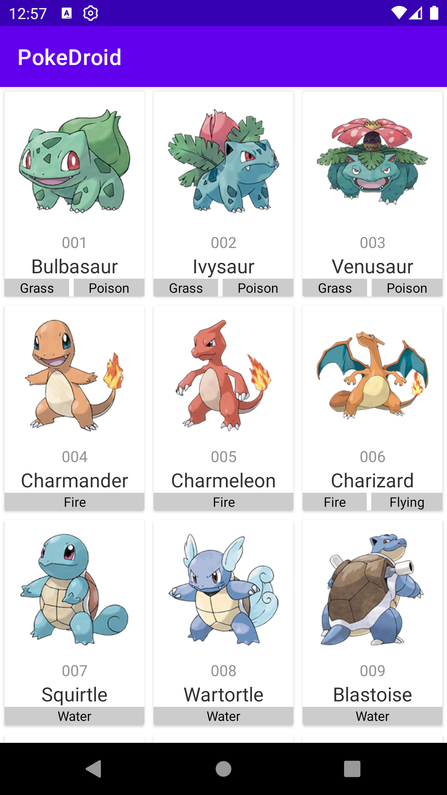

# PokéDroid
PokéDex (Pokeagenda) feita em Kotlin alimentada pela PokéAPI.

Autor: Guilherme Reis - [LinkedIn](https://www.linkedin.com/in/guilhermereisdev/)

### Recursos do app

- Exibe os Pokémon na ordem da Pokédex original.

### Técnicas utilizadas

- Conexão à [PokéAPI](https://pokeapi.co/) para acesso aos dados dos Pokémon.
- Retrofit2 como biblioteca de HTTP Client.

### Telas

_Clique na imagem para ver em tela cheia_

 